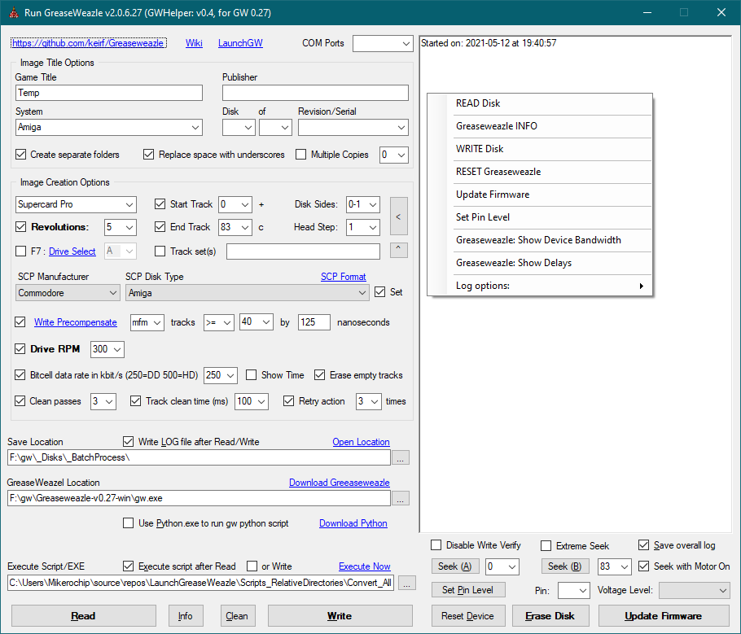

# LaunchGreaseWeazle
Simple program for windows to run the command line Greaseweazle program.

It uses .net framework 4.

(I'm sure there are better ways to read the command line output, but I don't know any!)

### To use:
Download Greaseweasle and unpack.

Select the gw.exe in the Greaseweazle folder, and your save folder.

Set your com port, your disk name, and click [Read].

(You can also leave the COM port blank. It's only useful if the GW hardware isn't auto detected, or you have more than one GW device connected.)

(If you get a message saying GW tools are our of date, expand the program screen, and update your device.)

### To update your device: 
Select the new GW.EXE if upgrading to a new version.
Disconnect GW device, bridge the pins as directed, reconnect and click [Update firmware] and pick the .upd file.

### To update the firmware: 
Hold the [CTRL] key, and click [Update firmware]. GW does not need update pins strapped to do this. 
(Also note, this is not usually needed)

### To read HD disks:
Set the bitcell rate checkbox, and change the rate to 500 before reading.

HD floppy disk and disk drive required for HD reading.

If unchecked, disks are read at DD rate.